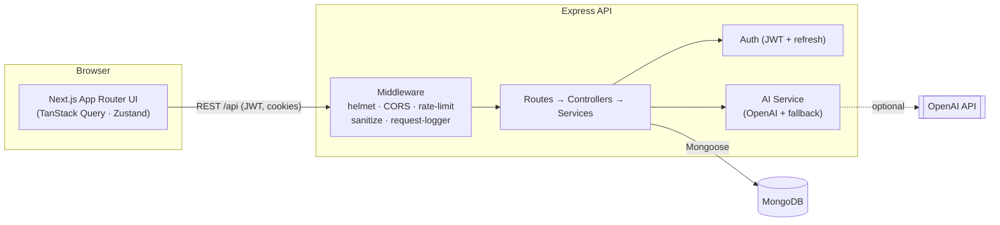

<div align="center">

# 🎯 AI Study Planner

**Full-stack study planner with AI-generated study plans, task management, a Pomodoro timer, and analytics.**

[](https://github.com/tsunade601/ai-study-planner/actions/workflows/ci.yml)


</div>

---

## ✨ Features

- **AI study plan generation** with a validated JSON schema and a graceful built-in fallback (works even without an OpenAI key).
- **Study plans, tasks, and analytics** dashboards with charts.
- **Pomodoro timer** with custom cycles, sound, browser notifications, and automatic focus-session logging to the active plan.
- **Dark mode**, page transitions, toast notifications, loading states, and error boundaries.
- **Security hardening**: JWT access + rotating refresh tokens (HttpOnly cookies), rate limiting, input sanitization, Helmet, CORS, and env validation.
- **Production-ready ops**: structured JSON logging with request-correlation ids, liveness/readiness probes, graceful shutdown, Docker + docker-compose, and CI.

## 🧱 Tech Stack

| Layer      | Technologies                                                               |
| ---------- | -------------------------------------------------------------------------- |
| Frontend   | Next.js 15 (App Router), React 18, TypeScript, Tailwind CSS, TanStack Query, Zustand, Recharts, Framer Motion |
| Backend    | Node.js 20, Express, Mongoose, Pino                                        |
| Database   | MongoDB                                                                     |
| Auth       | JWT access + refresh tokens, HttpOnly refresh cookies                      |
| AI         | OpenAI (with deterministic fallback)                                       |
| Tooling    | ESLint, Prettier, Jest + Supertest, GitHub Actions, Docker                 |

## 🏗️ Architecture



See [`docs/ARCHITECTURE.md`](docs/ARCHITECTURE.md) for a deeper walk-through of the request lifecycle, auth flow, and folder layout.

## 📁 Project Structure

```text
ai-study-planner/
├── backend/                 # Express + Mongoose API
│   ├── src/
│   │   ├── app.js           # Express app (middleware, routes, probes)
│   │   ├── config/          # env validation + db connection
│   │   ├── controllers/     # HTTP handlers
│   │   ├── middleware/       # auth, error, sanitize, rate-limit, logging
│   │   ├── models/          # Mongoose schemas
│   │   ├── routes/          # route definitions
│   │   ├── services/        # business logic (auth, tasks, plans, AI, analytics)
│   │   └── utils/           # logger, jwt, response helpers
│   ├── tests/               # Jest + Supertest
│   └── Dockerfile
├── frontend/                # Next.js 15 app
│   ├── src/{app,components,hooks,lib,store,types}
│   └── Dockerfile
├── docs/                    # architecture & deployment guides
├── docker-compose.yml
└── .github/workflows/ci.yml
```

## 🚀 Quick Start

### Option A — Docker (recommended)

```bash
cp .env.example .env          # set JWT_SECRET (32+ chars) and optionally OPENAI_API_KEY
docker compose up --build
```

- Frontend → http://localhost:3000
- Backend  → http://localhost:5000/api/health
- MongoDB  → localhost:27017

### Option B — Local dev

```bash
# 1) Install
cd backend && npm install
cd ../frontend && npm install

# 2) Environment
cp backend/.env.example backend/.env
cp frontend/.env.example frontend/.env.local

# 3) Run (two terminals)
cd backend && npm run dev
cd frontend && npm run dev
```

## ⚙️ Environment Variables

### Backend (`backend/.env`)

| Variable                 | Required | Default        | Description                                  |
| ------------------------ | -------- | -------------- | -------------------------------------------- |
| `PORT`                   | no       | `5000`         | API port                                     |
| `NODE_ENV`               | no       | `development`  | `development` \| `test` \| `production`      |
| `LOG_LEVEL`              | no       | env-dependent  | `trace`…`fatal` \| `silent`                  |
| `MONGODB_URI`            | **yes**  | —              | MongoDB connection string                    |
| `JWT_SECRET`             | **yes**  | —              | Signing secret (use 32+ chars in production) |
| `JWT_EXPIRES_IN`         | no       | `15m`          | Access-token TTL                             |
| `JWT_REFRESH_EXPIRES_IN` | no       | `30d`          | Refresh-token TTL                            |
| `OPENAI_API_KEY`         | no       | —              | Enables live AI; falls back when unset       |
| `OPENAI_MODEL`           | no       | `gpt-4o-mini`  | OpenAI model id                              |
| `CLIENT_URL`             | no       | `http://localhost:3000` | CORS origin                         |

### Frontend (`frontend/.env.local`)

| Variable               | Default                       | Description             |
| ---------------------- | ----------------------------- | ----------------------- |
| `NEXT_PUBLIC_API_URL`  | `http://localhost:5000/api`   | Backend API base URL    |
| `NEXT_PUBLIC_APP_URL`  | `http://localhost:3000`       | Public app URL          |

## 📡 API

### Health / Ops

- `GET /api/health` — liveness probe (`{ status, uptime, timestamp }`)
- `GET /api/ready` — readiness probe (verifies DB connectivity; `200`/`503`)

### Auth

- `POST /api/auth/register` · `POST /api/auth/login` · `POST /api/auth/refresh` · `POST /api/auth/logout`
- `GET /api/auth/me` · `PATCH /api/auth/me`

### Study Plans

- `GET/POST /api/study-plans` · `GET/PATCH/DELETE /api/study-plans/:id`
- `POST /api/study-plans/:id/log-hours` · `POST /api/study-plans/ai/suggest`

### Tasks

- `GET/POST /api/tasks` · `GET/PATCH/DELETE /api/tasks/:id`

### Analytics

- `GET /api/analytics/summary` · `GET /api/analytics/daily?days=30` · `GET /api/analytics/subjects`

## 🧪 Testing & Quality

```bash
# Backend
cd backend
npm run lint          # ESLint
npm run format:check  # Prettier
npm test              # Jest + Supertest (with coverage)

# Frontend
cd frontend
npm run lint
npm run build
```

CI runs all of the above plus Docker image builds on every push and PR — see [`.github/workflows/ci.yml`](.github/workflows/ci.yml).

## 📦 Deployment

See [`docs/DEPLOYMENT.md`](docs/DEPLOYMENT.md) for container, environment, and platform (Vercel / Render / Railway / Fly.io) deployment guidance.

## 🖼️ Screenshots / GIFs

Drop screenshots/GIFs here (see `docs/screenshots/`):

- `docs/screenshots/dashboard.png`
- `docs/screenshots/pomodoro.gif`
- `docs/screenshots/analytics.png`

## 🤝 Contributing

Contributions are welcome — please read [`CONTRIBUTING.md`](CONTRIBUTING.md).

## 📝 Notes

- The Pomodoro timer automatically logs completed focus sessions to the selected active study plan.
- Refresh tokens are rotated on login and refresh.
- AI features degrade gracefully to deterministic fallbacks when `OPENAI_API_KEY` is not configured.

## 📄 License

[MIT](LICENSE)
