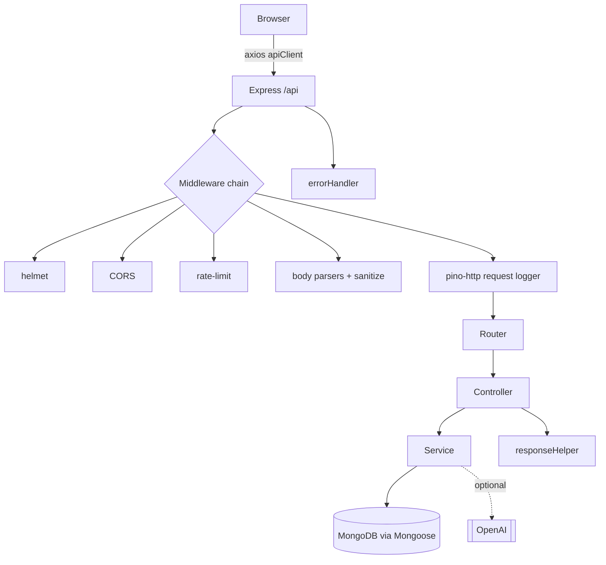

# Architecture

This document describes how the AI Study Planner is structured and how a request flows through the system.

## Overview

The app is a classic client/server split:

- **Frontend** — a Next.js 15 App Router application. Server components render the shell; client components (marked `'use client'`) handle interactivity. Data fetching and caching go through **TanStack Query**, and lightweight global state (auth) lives in **Zustand**.
- **Backend** — an Express API following a layered **Route → Controller → Service → Model** pattern. Cross-cutting concerns (security, logging, sanitization) are Express middleware.
- **Database** — MongoDB accessed through Mongoose models.
- **AI** — an isolated service that calls OpenAI when configured and otherwise returns deterministic fallback content, so the product never hard-fails on a missing key.

## Request lifecycle (backend)

1. `helmet` sets security headers.
2. `cors` restricts origins to `CLIENT_URL` and allows credentials (for the refresh cookie).
3. `express-rate-limit` throttles `/api/*`; auth-sensitive routes use stricter limiters in `middleware/rateLimiters.js`.
4. Body parsers cap payloads (`100kb`); `sanitizeMiddleware` strips dangerous input.
5. `requestLogger` (pino-http) attaches a per-request child logger with an `X-Request-Id` correlation id.
6. The router dispatches to a **controller**, which validates/adapts HTTP concerns and delegates to a **service**.
7. Services own business logic and talk to Mongoose models; responses are shaped by `utils/responseHelper.js`.
8. Any thrown error is normalized by `middleware/errorHandler.js` (Mongoose validation/cast/duplicate, JWT errors, and generic fallbacks) and logged via the request logger.

## Authentication

- On **login/register**, the API issues a short-lived **access token** (JWT, default 15m) and a long-lived **refresh token** (default 30d) stored in an **HttpOnly cookie**.
- The frontend keeps the access token in memory (Zustand) and attaches it as a `Bearer` header via an axios request interceptor.
- On a `401`, the axios response interceptor transparently calls `/api/auth/refresh` once, updates the token, and retries the original request. Refresh tokens are **rotated** on login and refresh.

## Observability & Ops

- **Structured logging**: Pino emits JSON in production and pretty logs in development. Sensitive fields (authorization, cookies, passwords, tokens) are redacted.
- **Probes**: `GET /api/health` (liveness) and `GET /api/ready` (readiness — checks the Mongoose connection state and returns `503` when the DB is down).
- **Graceful shutdown**: `SIGTERM`/`SIGINT` close the HTTP server and DB connection, with a forced-exit safety timeout. `unhandledRejection`/`uncaughtException` are logged.

## Folder responsibilities (backend)

| Path                 | Responsibility                                             |
| -------------------- | ---------------------------------------------------------- |
| `config/`            | Env validation and DB connection                           |
| `controllers/`       | HTTP request/response handling                             |
| `services/`          | Business logic, DB access, AI integration                  |
| `models/`            | Mongoose schemas & validation                              |
| `middleware/`        | Auth, error handling, sanitization, rate limiting, logging |
| `utils/`             | Logger, JWT helpers, response helpers                      |

## Frontend structure

| Path              | Responsibility                                    |
| ----------------- | ------------------------------------------------- |
| `app/`            | App Router pages, layouts, loading/error states   |
| `components/`     | UI, layout shell, dashboard, and Pomodoro widgets |
| `hooks/`          | TanStack Query hooks (`useTasks`, `useAnalytics`) |
| `lib/api.ts`      | axios client, auth interceptors, token refresh    |
| `store/`          | Zustand auth store                                |
| `types/`          | Shared TypeScript types                           |
